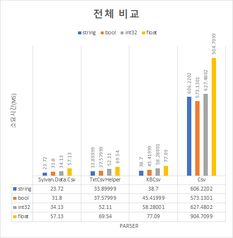

Unity에서의 CsvParser들의 성능 비교
===
- 테스트 PC : 개인 PC (CPU : i7-10700)
- 유니티 버전 : 2022.2.0a18
- Net Core : .NET Standard 2.1

 

## 목표 
---
1. [Joel Verhagen](https://www.joelverhagen.com/blog/2020/12/fastest-net-csv-parsers)에서 표기된 Parser의 소요시간 차이가 유니티에서도 유지되는지 확인
2. 각 타입별(string, bool, float, int32)에 대한 Parser들의 유니티에서의 소요시간 비교

 

## 사용 CSV Parser
---
1. Sylvan.Data.Csv (1.1.16 ver)
    * Joel Verhagen 측정 결과 1.4s
    * 소요시간이 2미만 중 하나 선택
2. TxtCsvHelper(1.3.3 ver)
    * Joel Verhagen 측정 결과 3.2s
    * 소요시간이 3이상 4미만 중 하나 선택
3. KBCsv (6.0.0 ver)
    * Joel Verhagen 측정 결과 4.1s
    * 소요시간이 4이상 5미만중 하나 선택
4. Csv (2.0.84 ver)
    * Joel Verhagen 측정 결과 19.7s
    * 소요시간이 12 이상 중 하나 선택
  
 

## 가정
---
1. 데이터 파일의 모든 데이터 타입이 같다고 가정
2. 데이터에 헤더 중복이 없다고 가정

 

## 테스트 방법
---
1. Record class를 만들어 헤더와 헤더에 대한 값을 가지는 Dictionary 생성
2. 각 Parser들을 만들어 타입별 Dictionary에 데이터를 Parser 후 저장
3. 위 과정을 100번 반복 후 평균 소요시간 측정
4. 각 테스트는 unity의 test runner를 사용하여 PlayMode에서 테스트

 

## 결과
---
 

### 1. 전체 비교 

 

 

### 2. 타입별 비교

 
 

 

## 결과 분석
---
 Csv를 제외하고선 string의 parsing 소요시간이 가장 적었고 그 다음으로는 bool, int32, float타입 순이었다. 하지만 각 타입별로 비교해보았을 때 Sylvan.Data.Csv, TxtCsvHelper, KBCsv, CSV순으로 소요시간이 적다. 따라서 csv 파일을 적어도 string, bool, float, int32로 parsing 하는데에는 속도면에서 sylvan.data.csv가 유리하다.

 

## 한계
---
1. Sylvan.Data.Csv가 가장 빠른 이유는 Parser을 하는 과정에서 나머지 세 Parser와 다르게 내부적으로 타입을 변환하는 코드가 있기 때문이라고 추측된다. TxtCsvHelper도 TypeConversion이 있긴 했지만 c#의 TryParse를 사용하고 있었다. 다만, Sylvan.Data.Csv가 활용하는 Parser방식과 c#의 TryParse작동원리를 정확하게 알아내지 못했다.

2. 테스트 횟수가 각 100번이라는 점, 데이터의 종류가 타입 한가지로 일관되어 좋은 테스트 케이스는 아니라는 점이 있다.

3. Parse를 각 타입별로 최대한 빠른 방법을 비교하지 않았다는 것이 있다. 각 Parser마다 csv를 parsing하는 방법에 따라 소요시간 차이가 있을 텐데 각 parser마다 방법에 따른 차이를 비교하지 못했다.

4. 중복 헤더를 가지는 csv에 대해서는 테스트를 하지 않았다.

 

## 사용 데이터
---
[string data](Assets/Resources/TestCSVData/TestDataNoSameColumn.csv)

[int32 data](Assets/Resources/TestCSVData/TestDataNoSameColumnInt.csv)

[bool data](Assets/Resources/TestCSVData/TestDataNoSameColumnBool.csv)

[float data](Assets/Resources/TestCSVData/TestDataNoSameColumnFloat.csv)

